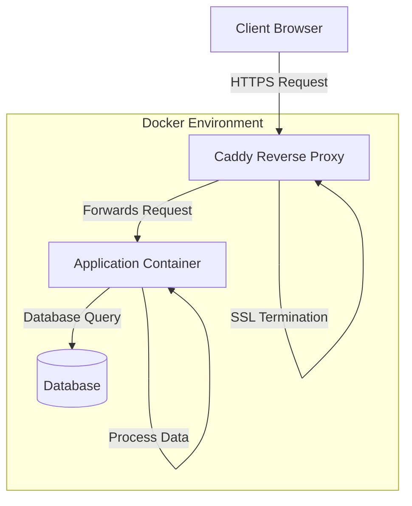

# Documentation Creation Guidelines for WindyCityWire Repositories

## Overview

This document provides comprehensive guidelines for AI assistants to create professional documentation for WindyCityWire repositories. Follow these instructions to ensure consistency, completeness, and maintainability across all repository documentation.

## Table of Contents

1. [General Documentation Principles](#general-documentation-principles)
2. [Repository Structure](#repository-structure)
3. [README.md Format and Sections](#readmemd-format-and-sections)
4. [Script Documentation](#script-documentation)
5. [Diagrams and Visualizations](#diagrams-and-visualizations)
6. [Deployment and Management Instructions](#deployment-and-management-instructions)
7. [Security Considerations](#security-considerations)
8. [Style Guide](#style-guide)
9. [Special Templates and Patterns](#special-templates-and-patterns)
10. [Docker-Specific Documentation](#docker-specific-documentation)

## General Documentation Principles

### Audience Awareness
- Primary audiences include:
  - Future AI LLM instances (requiring explicit, detailed context)
  - Future developers (who may be unfamiliar with the system)
  - Current developers (as a reference)
  - System administrators (for deployment and maintenance)

### Completeness
- Documentation must be self-contained and comprehensive
- Include all necessary context, without assuming prior knowledge
- Explain "why" as well as "how" for key decisions and configurations

### Technical Precision
- All commands must be correct and tested
- All paths must match WindyCityWire's established directory structure patterns
- Include explicit version numbers for all software dependencies

### Maintainability
- Structure the documentation to remain valid even as specific versions change
- Clearly separate conceptual information from version-specific details
- Identify potential areas of change and document how to handle them

## Repository Structure

### Standard Files
Include these files in every repository:

1. `README.md`: Primary documentation (see detailed section below)
2. `deploy.sh`: Deployment script with standard pattern:
   ```bash
   #!/bin/bash
   echo "Starting deployment..."
   git pull
   docker compose down
   docker compose up -d --build
   echo "Deployment complete!"
   ```
3. `.gitignore`: Appropriate for the project type
4. `.gitattributes`: Configure line endings and executable scripts:
   ```
   # Ensure shell scripts are executable when checked out on any system
   *.sh text eol=lf executable
   deploy.sh text eol=lf executable
   ```

### Directory Structure Patterns

Always follow these established patterns for directory structure:

- Docker project repositories: `/DockerProjects/<ProjectName>`
- Docker volume mounts: `/DockerVolumes/<ProjectName>/<volume-type>`
  - Common volume types: `config`, `data`, `logs`, `db`, `certs`

For new projects, explicitly document the directory structure within the README.md using either:
- A directory tree representation
- A table listing each directory and its purpose

## README.md Format and Sections

### Required Sections

1. **Title and Brief Description**:
   - Project name as title (H1)
   - One-paragraph summary of the project's purpose
   - Optional: Include a relevant logo or icon

2. **Table of Contents**:
   - Linked to all major sections
   - Use H2 headings for main sections, H3 for subsections

3. **Overview**:
   - Detailed description of the project
   - Purpose and business context
   - System architecture summary

4. **Features**:
   - Bullet-point list of key capabilities
   - Highlight integration points with other systems

5. **Architecture**:
   - Diagram (see Diagrams section for specific requirements)
   - Component descriptions
   - Network topology
   - Data flow explanation

6. **First-Time Setup**:
   - Prerequisites (with version requirements)
   - Step-by-step installation instructions
   - Post-installation verification steps

7. **Managing the Application/Container**:
   - Basic operations (start, stop, restart)
   - Monitoring commands and procedures
   - Troubleshooting with common issues and solutions

8. **Configuration**:
   - Configuration file locations and formats
   - Parameter descriptions
   - Sample configurations for different scenarios
   - Instructions for applying configuration changes

9. **Directory Structure**:
   - Complete listing of project directories
   - Purpose of each directory
   - Special considerations for any directory

10. **Maintenance and Updates**:
    - Update procedures
    - Backup and restore procedures
    - Version upgrade guidance

11. **Contributing** (for open repositories):
    - How to make and submit changes
    - Code style and contribution guidelines
    - Review process

12. **License and Copyright**:
    - For internal repositories:
      ```
      © [YEAR] Windy City Wire. All rights reserved.
      ```

### Optional (But Recommended) Sections

- **Security Considerations**: Authentication, authorization, encryption details
- **Performance Tuning**: Optimization guidelines
- **Integration Guide**: How to interface with other systems
- **FAQ**: Anticipated questions and answers
- **Glossary**: Project-specific terminology
- **Changelog**: Version history and significant changes
- **Contact**: Maintainer information

## Script Documentation

### Shell Scripts

For each shell script in the repository:

1. Include a header comment block:
   ```bash
   #!/bin/bash
   #
   # Script: script_name.sh
   # Purpose: Brief description of what the script does
   # Author: Original author name
   # Created: YYYY-MM-DD
   # 
   # Usage: ./script_name.sh [arguments]
   #
   # Arguments:
   #   arg1 - Description of argument 1
   #   arg2 - Description of argument 2
   #
   # Examples:
   #   ./script_name.sh example_value
   #
   # Exit codes:
   #   0 - Success
   #   1 - General error
   #   2 - Specific error condition
   ```

2. Document each function with comments:
   ```bash
   # Function: function_name
   # Description: What this function does
   # Arguments:
   #   $1 - Description of argument 1
   # Returns:
   #   Description of what the function returns or outputs
   function_name() {
       # Implementation
   }
   ```

3. Include comments for complex or non-obvious logic
4. Use echo statements for important operations to provide runtime visibility

### Docker Compose and Dockerfile

For `docker-compose.yml` and `Dockerfile`:

1. Add comments before each section:
   ```yaml
   # Service: service_name
   # Purpose: Description of this service's role
   service_name:
     # Use specific version tag for stability
     image: image_name:version
     # Mount volumes with clear purpose descriptions
     volumes:
       - /host/path:/container/path # Store persistent data
   ```

2. Explain all environment variables:
   ```yaml
   environment:
     # Controls logging verbosity (options: debug, info, warn, error)
     - LOG_LEVEL=info
     # API key for external service authentication
     - API_KEY=${API_KEY}
   ```

## Diagrams and Visualizations

### Mermaid Diagrams

When creating Mermaid diagrams:

1. Always provide the raw Mermaid code for manual rendering
2. Use `<br/>` for line breaks instead of `\n`
3. Keep diagrams focused on one aspect of the system
4. Include a text description of what the diagram shows
5. Follow this structure:

````
Here's a diagram showing the component interactions:



To use this diagram, copy the code between the triple backticks and paste it into a Mermaid renderer like https://mermaid.live
````

### Other Visualizations

For complex architecture or workflows:

1. Create an ASCII diagram for terminal-friendly viewing when appropriate
2. Reference existing company documentation for standard patterns
3. Use tables for comparing features, options, or configurations

## Deployment and Management Instructions

### Deployment Instructions

Structure deployment instructions in this order:

1. Prerequisites
2. Environment preparation
3. Configuration
4. Installation command sequence
5. Verification steps
6. Troubleshooting common deployment issues

Example:
````
## Deployment

### Prerequisites
- Docker Engine 25.0.0 or higher
- Docker Compose 2.22.0 or higher
- 4GB RAM minimum, 8GB recommended
- 10GB available disk space

### Environment Preparation
1. Create required directories:
   ```bash
   sudo mkdir -p /DockerProjects/ProjectName
   sudo mkdir -p /DockerVolumes/ProjectName/data
   ```

2. Set directory permissions:
   ```bash
   sudo chown -R $USER:$USER /DockerProjects/ProjectName
   sudo chown -R $USER:$USER /DockerVolumes/ProjectName
   ```

### Configuration
1. Clone the repository:
   ```bash
   cd /DockerProjects/ProjectName
   git clone https://github.com/WindyCityWire/project-name.git .
   ```

2. Edit the configuration file:
   ```bash
   nano /DockerVolumes/ProjectName/config/settings.conf
   ```
   
   Ensure these settings are configured:
   - `API_KEY`: Your API access key
   - `MAX_CONNECTIONS`: Set to 100 for production

### Installation
Run the deployment script:
```bash
./deploy.sh
```

### Verification
1. Check that the containers are running:
   ```bash
   docker ps | grep project-name
   ```

2. Verify the application responds:
   ```bash
   curl http://localhost:8080/health
   ```
   
   Expected output:
   ```json
   {"status":"healthy","version":"1.2.3"}
   ```

### Troubleshooting
- If containers fail to start, check logs:
  ```bash
  docker logs project-name-container
  ```
````

### Management Commands

Document management commands using tables for clarity:

```
| Operation | Command | Description |
|-----------|---------|-------------|
| Start | `docker compose up -d` | Start all containers in detached mode |
| Stop | `docker compose down` | Stop and remove containers |
| Restart | `docker compose restart` | Restart all containers |
| View Logs | `docker logs container-name` | Display container logs |
| Enter Shell | `docker exec -it container-name /bin/sh` | Access container shell |
```

## Security Considerations

For all documentation, include:

1. Network security details:
   - Required ports and protocols
   - Firewall configuration recommendations
   - Network isolation recommendations

2. Authentication:
   - Default credential warnings
   - Authentication mechanisms
   - Password policies

3. Data protection:
   - Sensitive data handling
   - Backup encryption recommendations
   - Data retention policies

4. Secrets management:
   - Environment variable usage
   - Secrets storage recommendations
   - Credential rotation procedures

## Style Guide

### Formatting

- Use semantic Markdown formatting:
  - H1 (`#`) for document title
  - H2 (`##`) for major sections
  - H3 (`###`) for subsections
  - H4 (`####`) for minor sections
  - Code blocks with language specification: ```bash, ```yaml, etc.
  - Inline code for commands, file paths, and variables: `command`

### Language Guidelines

- Use active voice: "Run the command" not "The command should be run"
- Write in second person: "You should configure..." not "One should configure..."
- Be concise but complete
- Use consistent terminology throughout
- Define abbreviations on first use
- Use imperative mood for instructions: "Create a directory" not "Creating a directory"

### Code Examples

- Include full comments in code examples
- Show expected output for important commands
- Highlight critical lines in complex examples
- Use placeholders in angle brackets for variables: `<your-value-here>`

## Special Templates and Patterns

### Error Handling Sections

For critical operations, include an error handling section:

````
### Error Handling

If you encounter error "Connection refused":
1. Check that the database container is running:
   ```bash
   docker ps | grep database
   ```
2. Verify network connectivity:
   ```bash
   docker network inspect my_network
   ```
3. Check database logs:
   ```bash
   docker logs database-container
   ```
````

### Version-Specific Instructions

When different versions require different instructions:

````
### Configuration

#### For version 1.x
```bash
# Version 1.x uses INI format
parameter1=value1
parameter2=value2
```

#### For version 2.x and above
```yaml
# Version 2.x uses YAML format
parameters:
  parameter1: value1
  parameter2: value2
```
````

## Docker-Specific Documentation

For Docker-based repositories, always include:

### Container Details

Document details about each container:

```
### Container: container-name

**Image:** `image:tag`
**Purpose:** Brief description of container's role
**Dependencies:** List of other containers this container depends on

**Volumes:**
- `/host/path:/container/path`: Purpose of this volume

**Environment Variables:**
- `VARIABLE_NAME`: Description and possible values

**Ports:**
- `8080:80`: Purpose of this port mapping

**Health Check:**
- Endpoint: `/health`
- Expected response: `{"status":"healthy"}`
```

### Network Configuration

Document all Docker networks:

```
### Docker Networks

This project uses the following Docker networks:

**WCW_Container_Proxy_Net-Linux** (external)
- Purpose: Connects public-facing services
- Connected containers: caddy, web-app

**backend-network** (internal)
- Purpose: Internal communication between application and database
- Connected containers: web-app, database
```

### Volume Management

Document all persistent volumes:

```
### Volume Management

This project stores persistent data in the following locations:

**Configuration:**
- Host path: `/DockerVolumes/ProjectName/config`
- Critical files:
  - `settings.conf`: Main configuration file
  - `users.json`: User definitions

**Data:**
- Host path: `/DockerVolumes/ProjectName/data`
- Contents: Application database and user uploads
- Backup recommendation: Daily backup with retention of 30 days

**Logs:**
- Host path: `/DockerVolumes/ProjectName/logs`
- Contents: Application logs, rotated weekly
- Retention policy: 90 days
```

## Final Checklist

Before considering documentation complete, verify:

- [ ] All sections from the [Required Sections](#required-sections) list are included
- [ ] Commands have been tested on a clean environment
- [ ] Diagrams accurately represent the current architecture
- [ ] Security considerations are thoroughly documented
- [ ] Contact information for the maintainer is included
- [ ] Directory structure matches company standards
- [ ] Document is free of placeholder text or TODOs
- [ ] All code examples include expected output where appropriate
- [ ] Any external dependencies are clearly documented with version requirements
- [ ] GitHub repository settings (branch protection, access) are documented

---

By following these guidelines, you will create comprehensive, consistent, and maintainable documentation for WindyCityWire repositories that will be valuable for both human and AI users.

© 2025 Windy City Wire. All rights reserved.